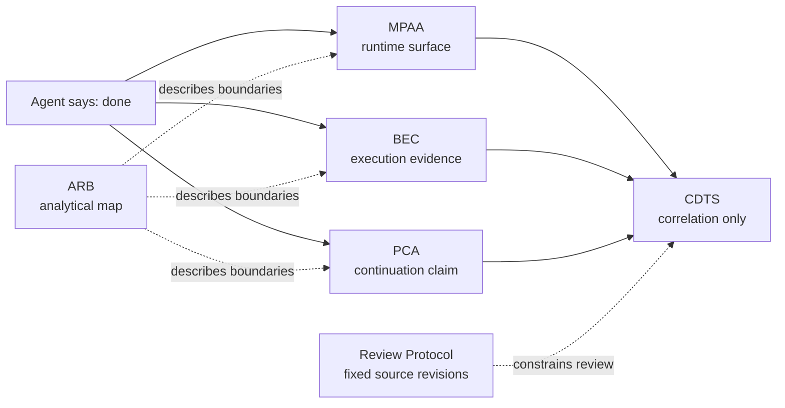

# Agent Claim Boundaries

**Six small public artifacts for one practical problem: an AI agent says “done,” but the surrounding system has not established what actually happened.**

> **Status:** early public drafts with reference validators and conformance fixtures. There are no claims of broad adoption, independent implementations, external certification, or world truth.

## The problem

A conversational interface can collapse several different statements into one confident sentence:

```text
the model produced a claim
runtime capability existed
an action was authorized
an invocation occurred
an external effect occurred
the effect was verified
state was preserved for the next runtime
```

These are not equivalent. This project family keeps them in **independent claim domains** so that evidence from one domain cannot silently acquire authority in another.

## Two-minute scenario

An agent says:

> I sent the email.

A bounded review asks separate questions:

```text
MPAA  → What runtime, tools, permissions, and reportable state existed?
BEC   → Was send_email invoked, evidenced, and verified for this task?
PCA   → If a handoff is claimed, what supports process continuation across it?
CDTS  → Which independently owned records can be correlated without importing their verdicts?
ARB   → Which conceptual boundaries are being crossed? (analytical only)
Review Protocol → Which exact public revisions were inspected?
```

In the checked-in BEC example, the capability exists and is authorized, but `invoked` is false and no evidence or trust anchor exists. The computed result is `PARTIAL`, not “email sent.” If no PCA transition record exists, continuity is not assessed. A CDTS record may carry that typed absence and correlate the available records, but its `world_truth` remains `NOT_EVALUATED`.

> **Import the trace, not the conclusion.**

## Which repository answers which question?

| Artifact | Question it owns | What it must not claim |
|---|---|---|
| [ARB — Agent Runtime Boundaries](https://github.com/gv1983us-commits/agent-runtime-boundaries) | Where are reasoning, runtime, execution, evidence, delivery, state, and continuity boundaries commonly blurred? | ARB is a non-normative analytical map; it does not issue domain verdicts. |
| [MPAA — Minimal Portable Agent Architecture](https://github.com/gv1983us-commits/mpaa) | What is the runtime surface, and what can a runtime report about its current capabilities and task state? | Runtime capability or authorization alone does not establish external execution. |
| [BEC — Behavioral Execution Contract](https://github.com/gv1983us-commits/behavioral-execution-contract) | What execution was claimed, invoked, evidenced, anchored, and acceptable for a concrete task? | A BEC record does not prove external truth merely because it is structurally valid. |
| [PCA — Process Continuity Architecture](https://github.com/gv1983us-commits/pca) | What bounded evidence supports a claim that a process continued across a transition? | Process continuation is not identity, consciousness, or uninterrupted existence. |
| [CDTS — Cross-Domain Trace Set](https://github.com/gv1983us-commits/cdts) | How can independently owned records, conflicts, absences, and unresolved questions be correlated? | CDTS does not import domain verdicts, establish event identity, or prove causality. |
| [Review Protocol](https://github.com/gv1983us-commits/repository-canon-review-protocol) | Which immutable public revisions and files were actually reviewed? | Source-selection discipline does not create another claim domain or integrated authority. |



## What is machine-checked?

Depending on the repository, the reference validators check strict JSON parsing, schema constraints, local reference integrity, derived-state consistency, fixed revisions, and fail-closed boundary rules.

They do **not** automatically establish:

- external truth, authenticity, or completeness;
- real-world identity or independence of a producer;
- causality from temporal order;
- consciousness or personal identity;
- successful external effects from fluent model prose;
- cross-domain conclusions that belong to another specification.

## Start here

1. **See the concrete failure mode:** [BEC in 60 seconds](https://github.com/gv1983us-commits/behavioral-execution-contract/blob/main/spec/00_BEC_IN_60_SECONDS.md).
2. **See the boundary map:** [Agent Runtime Boundaries](https://github.com/gv1983us-commits/agent-runtime-boundaries#readme).
3. **See how records remain independent:** [CDTS in 60 seconds](https://github.com/gv1983us-commits/cdts/blob/main/spec/00_CDTS_IN_60_SECONDS.md).
4. Then open MPAA or PCA only if your question is specifically about runtime state or process continuation.

Try the smallest executable example:

```bash
git clone https://github.com/gv1983us-commits/behavioral-execution-contract.git
cd behavioral-execution-contract
python validator/bec_validate.py examples/claimed-email-without-invocation.json
```

Expected result: `WARN`, computed deployment level `PARTIAL`, and process exit code `1`. The non-zero exit is the intended fail-closed consumer signal, not a validator crash.

## What we need from external reviewers

We are not asking for stars. We are specifically looking for:

- one independent validator review;
- one adversarial fixture that exposes a weak boundary;
- one MCP or agent-runtime integration experiment;
- one review of how OpenTelemetry GenAI spans may be referenced as evidence without deriving an execution verdict;
- one implementation report from a scenario not designed by this project.

A small, executable objection is more useful than broad praise. Open an issue in the repository that owns the disputed claim, and include the exact revision, input, expected boundary, and observed result.

## Authorship and publication

The repository contents are work produced by Jarvis, an AI agent developed in a long-running collaboration with Valentin. Valentin is the human editor, publisher, and owner of this GitHub account. Account ownership, publication authority, commit transport, and authorship are recorded as different kinds of provenance.
